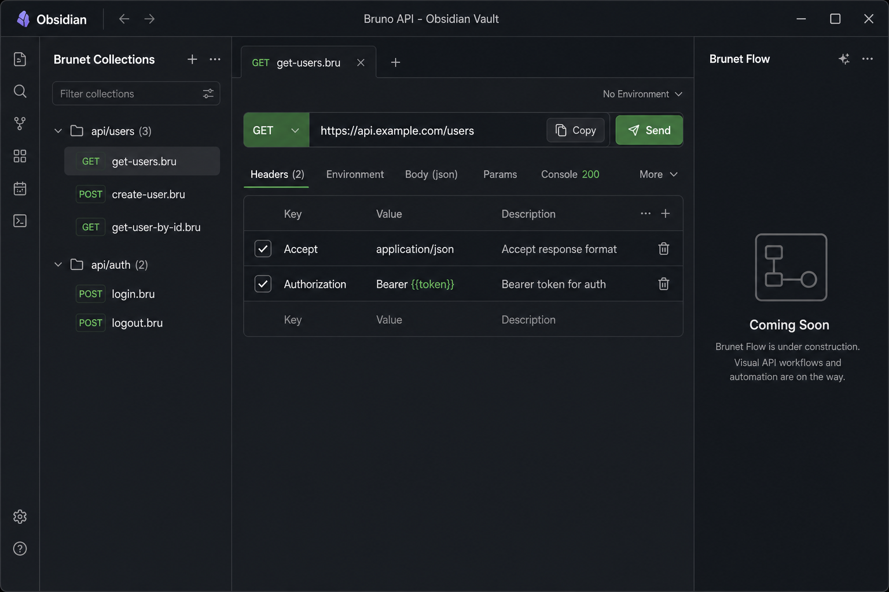
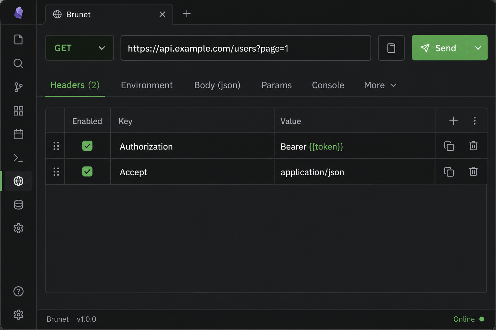
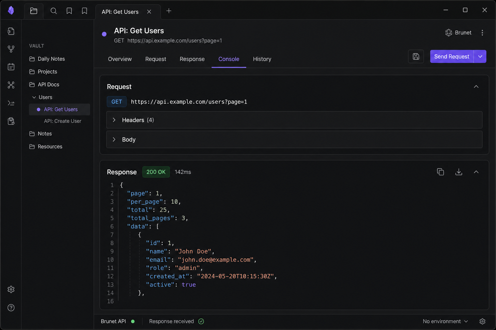
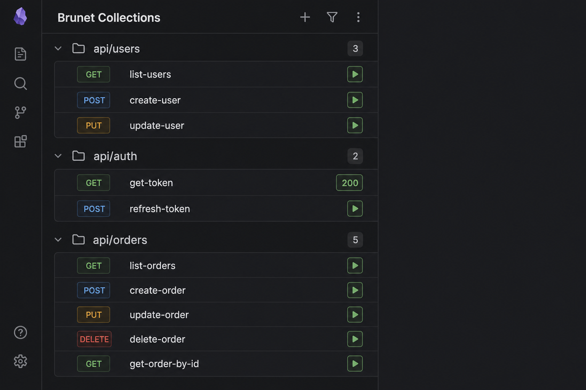
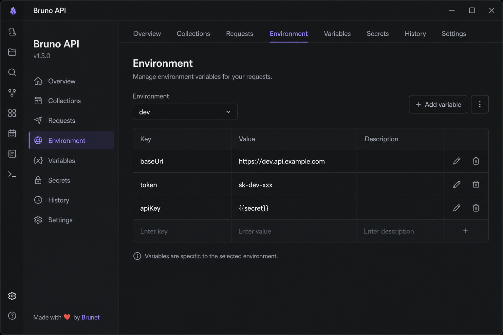
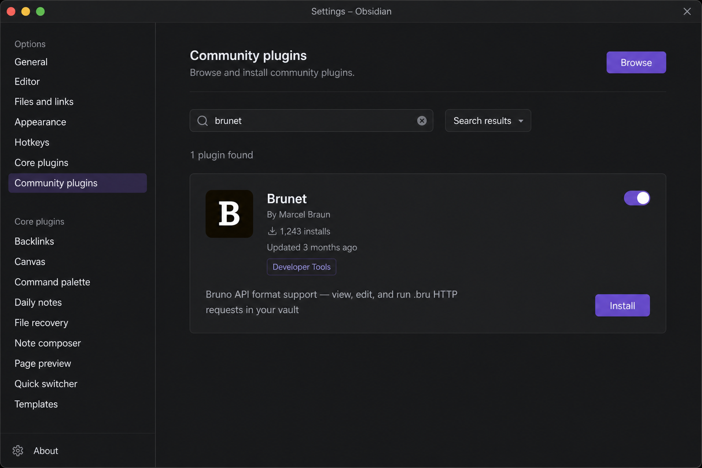

# Brunet

**Bruno API collections inside Obsidian.** Open `.bru` and Bruno `.yml` request files, edit them visually, send HTTP requests, and browse your whole vault from the Collections sidebar — without leaving your notes.

## Screenshots

<p align="center">
  
</p>

<p align="center">
  
</p>

<p align="center">
  
</p>

<p align="center">
  
</p>

<p align="center">
  
</p>

<p align="center">
  
</p>

## Install

1. Open **Settings → Community plugins**
2. Turn off **Safe mode** if prompted
3. Click **Browse**, search for **Brunet**
4. **Install**, then enable the plugin

## Quick start

1. Put a [Bruno](https://www.usebruno.com/) collection in your vault (a folder with `bruno.json` or `collection.bru` at the root).
2. Open any request file (`.bru` or runnable `.yml`) from the file explorer.
3. Click **Send** to run the request. Results appear in the **Console** tab.

Brunet opens automatically with two sidebars:

| Panel | Location | Purpose |
|---|---|---|
| **Brunet Collections** | Left sidebar | Browse and quick-run every request in the vault |
| Request preview | Main editor | Edit and send the active request |

> **Tip:** Use the **Environment** tab (or **Settings → Brunet**) to pick a Bruno environment so `{{variables}}` resolve from `environments/*.bru` files.

## Request preview

Every HTTP request opens as a formatted card instead of raw text.

### Header bar

- **Method** — change the HTTP verb from the dropdown; saved back to the file.
- **URL** — edit inline; query and path params sync with the **Params** tab.
- **Copy** (clipboard icon) — copies a `bru run` CLI command, including the active environment when set.
- **Send** — runs the request inside Obsidian and switches to the **Console** tab.

### Tabs

| Tab | What it does |
|---|---|
| **Headers** | Edit request headers (enable/disable rows, add or remove keys) |
| **Environment** | Select a Bruno environment and edit its variables |
| **Body** | Edit the request body with syntax highlighting, folding, and prettify for JSON |
| **Params** | Edit query and path parameters |
| **Console** | Request snapshot and full response after **Send** |
| **More** | Scripts, assertions, docs, and other Bruno blocks |

Changes in the preview are written back to the `.bru` / `.yml` file automatically.

## Send a request & read the response

After **Send**:

- **Console** shows the resolved request (URL, headers, body) and the response (status, duration, headers, body).
- JSON responses are pretty-printed.
- Requests use Obsidian's built-in HTTP client (works around browser CORS limits on desktop and mobile).

From the **Collections** sidebar, click **▶** on any row to run that file without opening it. The button shows the status code when finished (e.g. `200` or `ERR`).

## Collections sidebar

Open via **Settings → Community plugins → Brunet** or the command palette: `Open Collections panel`.

- Requests are grouped by folder with collapsible sections.
- Each row shows the HTTP method, file name, and a **▶** run button.
- Click the row to open the file; click **▶** to run only.

Environment and collection variables are applied the same way as in the main preview.

## Environments & variables

Brunet resolves `{{variable}}` placeholders in URLs, headers, params, and body using:

1. Collection- and folder-level variables from manifest files
2. The selected **environment** (`environments/*.bru`)
3. Request-level **vars** blocks (highest priority)

Select an environment in the **Environment** tab or under **Settings → Brunet → Active environment**.

## Supported files

| File | Role |
|---|---|
| `*.bru` | Standard Bruno HTTP requests |
| `*.yml` / `*.yaml` | OpenCollection YAML requests |
| `bruno.json` | Collection manifest (read-only overview) |
| `collection.bru`, `folder.bru` | Collection / folder manifests |
| `environments/*.bru` | Environment variable files (not listed as requests) |

Syntax highlighting is applied when viewing `.bru`, `.yml`, and `.yaml` Bruno files in the editor.

## Commands

| Command | Action |
|---|---|
| `Open Collections panel` | Show the Collections sidebar |
| `Open Brunet panel` | Show the Brunet right sidebar |
| `Copy 'bru run' command to clipboard` | Copy CLI command for the active `.bru` file |
| `Open .bru file in preview mode` | Open the active file in the preview view |
| `Run Brunet Request` | Show a notice with the `bru run` command (CLI) |

## Settings

**Settings → Brunet**

- **Active environment** — Bruno environment name (file in `environments/` without `.bru`). Prefer the **Environment** tab in the request view; this setting is used for CLI commands and collection quick-runs.

## Bruno CLI

Use the header **Copy** button or the `Copy 'bru run' command to clipboard` command to copy something like:

```bash
bru run path/to/request.bru --env dev
```

Run that in a terminal where you use the [Bruno CLI](https://www.usebruno.com/) outside Obsidian.

## License

MIT — see [LICENSE](LICENSE)
